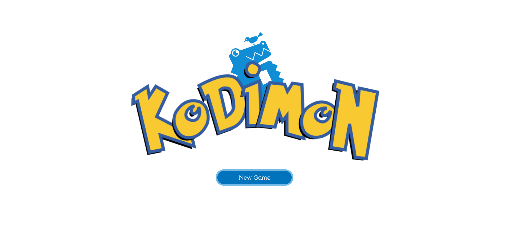
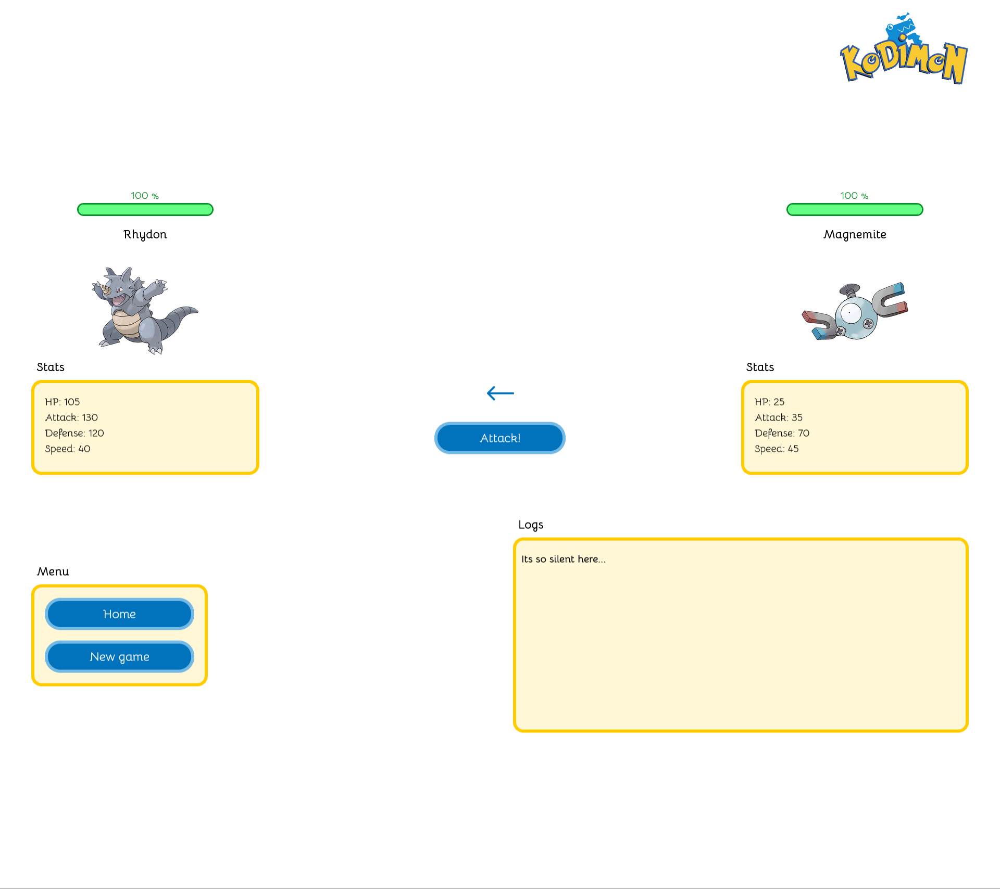

# KODIMON

version: 1.0





# Local Project Setup

> :warning: **Make sure to delete .example from .env.example before running the project**

```shell
git clone https://github.com/kristijan-kresic-hvar/kodimon.git

cd kodimon

npm install or yarn

npm run dev or yarn dev
```

# Decisions

1. Did not used any third party state management library as I consider it to be overkill for an app this small, I used context instead
2. Did not used any css in js libraries as I dont use them and dont like them. I very much prefer the module css/sass way I used here
3. Did not have the time to finish new opponnent functionality unfortunately, So I removed it altogether
4. Did not used any animation libraries to prove my raw css skills